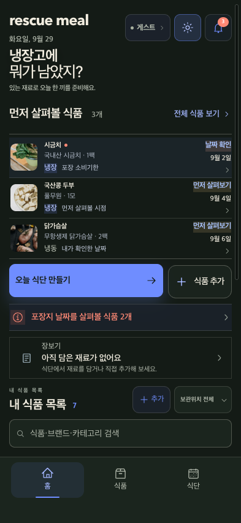
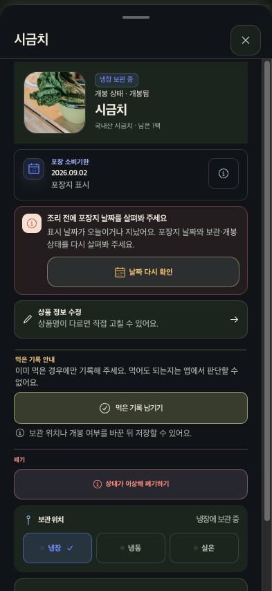
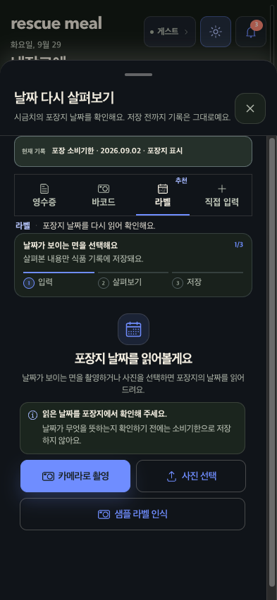

# Rescue Meal 모바일 흐름 확인

- 날짜/테마/화면: 2026-09-29, 다크모드, 393 × 852 CSS px
- 범위: 홈 → 시금치 상세 → 포장지 날짜 다시 확인
- 종료 상태: 시트를 닫고 홈으로 복귀. 날짜·보관·소비 기록 저장, 카메라/사진/샘플 인식 사용 없음.

## 1. 홈 — 양호

- 먼저 볼 식품과 식단 CTA가 초반에 있고, 날짜를 확인할 식품과 먼저 살펴볼 식품의 문구가 구분됩니다.
- 포장지 날짜 확인 안내가 별도 한 줄로 노출되고, 하단 고정 메뉴도 393px 폭에서 화면 밖으로 잘리거나 가로로 넘치지 않습니다.
- 첫 화면에 정보가 많이 들어가지만 제목, 우선 목록, 주요 동작, 안내, 내 식품 목록의 순서가 읽힙니다. 실제 작은 글씨 가독성은 확대/기기 확인이 남습니다.

## 2. 시금치 상세 — 양호

- `2026.09.02 · 포장지 표시`처럼 날짜와 출처를 함께 보여 주고, 날짜가 지난 상태를 “먹으면 안 된다”로 단정하지 않습니다.
- “포장지 날짜와 보관·개봉 상태를 다시 살펴봐 주세요”가 다음 행동을 알려줍니다. 먹은 기록은 이미 먹은 경우에만 남기도록 설명하고, 폐기 동작은 별도 경고 영역으로 분리되어 있습니다.
- 상세는 세로로 스크롤되지만 날짜 재확인과 소비/폐기 선택, 보관 위치가 모바일 시트 안에서 찾을 수 있습니다. 하단에 이어지는 내용의 실제 스크롤 조작과 키보드 동작은 이번 범위에서 확인하지 않았습니다.

## 3. 날짜 다시 살펴보기 — 양호

- 기존 기록을 상단에 고정해 보여 주고, “저장 전까지 기록은 그대로예요”와 1/3 진행 표시로 현재 상태와 되돌릴 수 있는 경계를 알립니다.
- 포장지에서 확인하기 전 소비기한으로 저장하지 않는다는 안내가 안전상 중요한 의미를 분명히 합니다. 라벨 탭의 추천 표식도 일반 사용 탭 이름과 별도로 전달됩니다.
- 다이얼로그 제목은 실제로 접근성 이름에 연결되어 있습니다. 바텀시트가 `Dialog.Title`을 사용하고, 접근성 테스트에서 이름으로 다이얼로그를 찾으며, 날짜 확인 시트 axe 검사가 통과했습니다.
- 현재 데모에는 `샘플 라벨 인식`이 카메라 촬영·사진 선택과 같은 수준으로 보입니다. 정식 런타임에서는 이 샘플 동작을 숨긴다는 테스트 계약이 있지만, 데모를 보는 사람에게는 실제 인식 기능과 혼동될 수 있어 데모용임을 표시하는 편이 낫습니다.

## 접근성 및 검증 한계

- 닫기와 날짜 재확인 주요 버튼은 44px 높이, 방법 탭은 54px 높이로 관찰했습니다. 현재 탭 이름과 주요 버튼 이름은 접근성 트리에 표시됩니다.
- 기존 axe 검사를 320×740 및 393×852, 라이트·다크 조합으로 실행해 통과했습니다. 다만 대비를 별도로 재계산하거나 키보드 전용 조작, 실제 스크린리더, 확대/큰 글자, 카메라·사진 선택·인식 결과를 직접 확인하지는 않았습니다. 따라서 WCAG 전체 준수로 볼 수 없습니다.
- 확인 후 날짜 재확인과 상세 시트를 닫았습니다. 홈의 시금치 날짜 표시는 바뀌지 않았고, 저장 동작은 실행하지 않았습니다.

## 다음 개선 권고

1. 데모 화면에서만 보이는 `샘플 라벨 인식`에 `데모` 표식을 더해 실제 인식 동작과 구분합니다.
