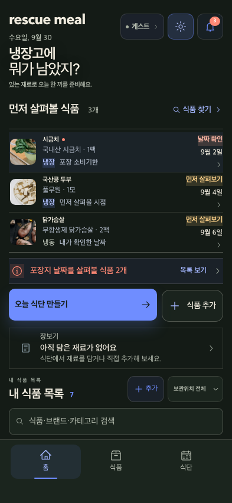
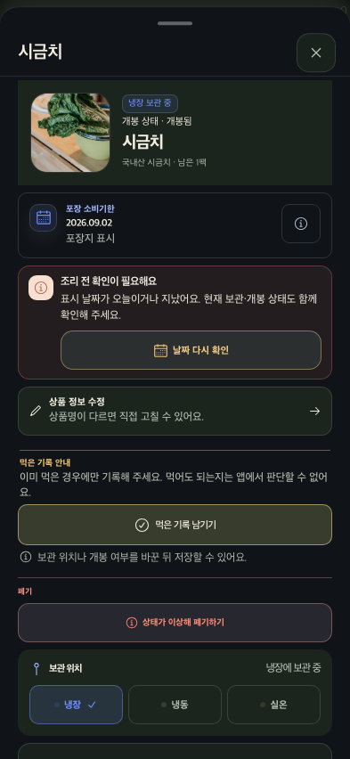
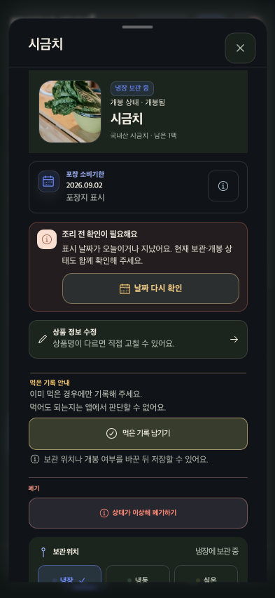
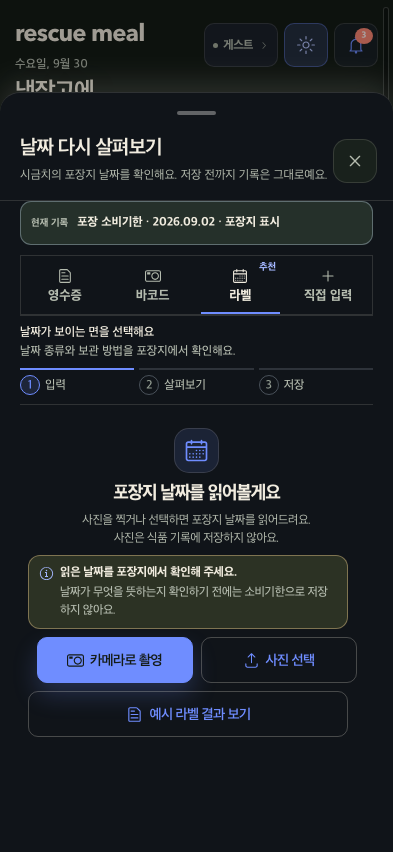

# 모바일 식품 확인 흐름 리뷰 · 2026-09-30

## 범위와 목표

- 범위: 격리된 데모의 393×852 다크 홈 → 시금치 상세 → 날짜 확인 시트.
- 목표: 먼저 살펴볼 식품을 찾고, 날짜 종류와 출처를 확인한 뒤, 저장 전에 날짜 의미를 점검한다.
- 제한: 카메라, 사진 선택, 예시 결과 확인, 소비 기록, 날짜 저장은 실행하지 않았다. 일반 식품 추가 탭과 실제 기기 스크린리더는 확인하지 않았다.
- 비교 맥락: 사용자가 선택한 KakaoPay식 빠른 정보 파악·명확한 다음 행동 방향을 참고한다. KakaoPay 화면을 직접 캡처하거나 동일 UI라고 주장하지 않는다.

## 단계별 리뷰

### 1. 홈 — 양호, 핵심 행동이 첫 화면에 있음

- `먼저 살펴볼 식품 3개`와 별도 `포장지 날짜를 살펴볼 식품 2개`가 서로 다른 범위임을 읽을 수 있다.
- 날짜 확인 대상이 첫 식품 행으로 이어지고, 상세 행동 전에는 `목록 보기` 및 `오늘 식단 만들기`·`식품 추가`가 눈에 들어온다.
- 모바일 첫 화면에 재고 목록·검색·하단 탭까지 밀도는 높지만, 중요 확인 요약이 주요 CTA보다 먼저 보여 우선순위가 맞다.

### 2. 식품 상세 — 출처·상태는 명확, 안전 안내 줄바꿈 개선

- 제품·수량·보관/개봉 상태와 `포장 소비기한 · 2026.09.02 · 포장지 표시`가 분리되어 날짜 종류와 출처를 구별하기 쉽다.
- 날짜 경고와 `날짜 다시 확인` 행동이 바로 붙어 있어 다음 행동이 분명하다. 먹은 기록과 날짜 확인도 시각적으로 분리된다.
- 개선 전 `먹어도 되는지는 앱에서 판단할 수 없어요.` 문구는 마지막 `어요.`가 단독 줄에 남았다. 문구 자체는 바꾸지 않고, 두 문장을 별도 12px 블록으로 나눴다. 320px 테스트에서 두 블록이 각각 한 줄인 것을 확인했다.

### 3. 날짜 확인 — 양호, 저장 전 맥락과 안전 경계가 보임

- 현재 기록된 날짜를 입력 방식 선택보다 먼저 보여준다.
- 단계 레일, 추천 라벨 입력, 읽은 날짜를 포장지와 확인하라는 안내가 이어진다. 날짜 뜻이 확인되기 전에는 소비기한으로 저장하지 않는다는 경계도 바로 보인다.
- 사진이 기록에 저장되지 않는다는 안내가 사진 선택 전에 노출된다. 촬영·파일선택은 누르지 않았으므로 OS 권한창이나 선택 후 오류 복구는 검증 범위에 없다.

## 이번 구현과 검증

- 상세의 먹은 기록 안전 안내를 2개의 짧은 블록으로 분리했다. 메시지의 의미는 그대로 유지했다.
- 날짜 재확인 CTA 글자를 11px에서 12px로 키웠다. 44px 이상 터치 높이와 라이트·다크 대비 기준은 유지했다.
- 상세 우선 행동 테스트 통과: 320px에서 두 안내 블록의 각 줄높이, 12px 글자, 행동 순서를 확인했다.
- 날짜 재확인 접근성/시각 테스트 통과: 라이트·다크, 393px에서 선택 탭 이름·색 대비·44px 터치 목표·단계 레일을 확인했다.
- 스크린샷만으로 전체 WCAG 준수나 실기기 보조기술 동작을 보증하지 않는다.

## 후속 우선순위

1. 영수증·바코드·직접 입력 및 날짜 재인식 결과/복구 흐름은 별도 브라우저 허가 후 같은 기준으로 리뷰한다.
2. 현재 전체 CSS는 324.6KB로 260KB 예산보다 크다. 여러 화면 상태를 폭넓게 확인하지 않은 채 스타일을 삭제하지 말고, 화면 소유권과 실제 사용 근거를 묶어 안전하게 줄인다.
